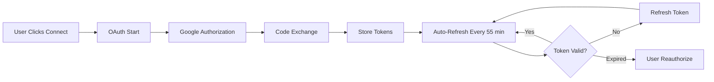
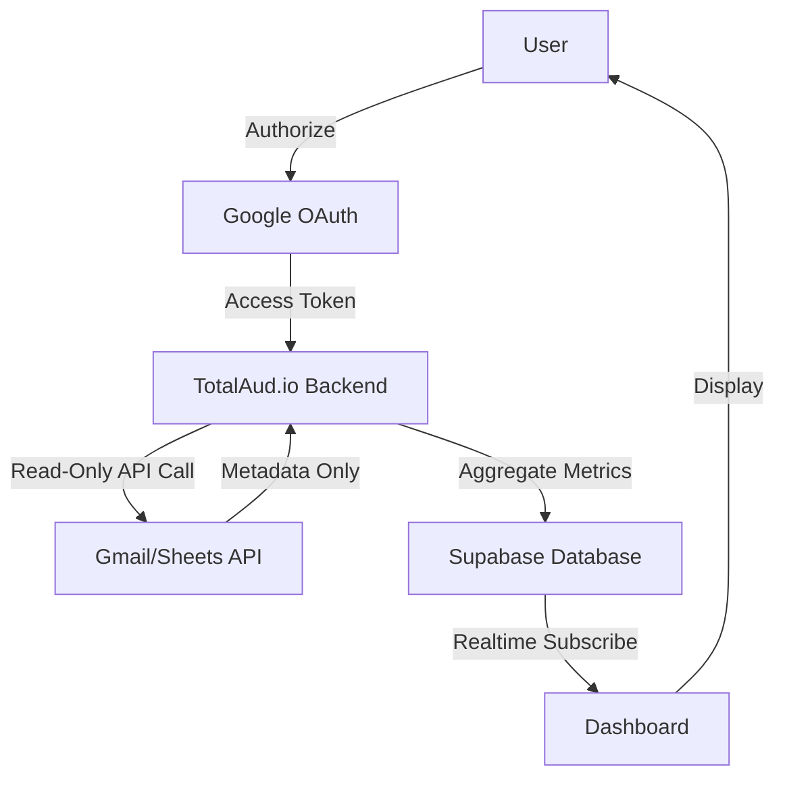

# Integrations Privacy & Security

**Last Updated**: October 2025
**Status**: Production
**Compliance**: GDPR, SOC 2 ready

---

## Overview

TotalAud.io integrations are designed with privacy and security as core principles. We request **minimal, read-only access** and never store sensitive personal data like email bodies or private documents.

**Design Principle**: "We only request what we need, and we only store metadata."

---

## OAuth Scopes Requested

### Gmail Integration

**Scopes**:
- `https://www.googleapis.com/auth/gmail.readonly` - Read-only access to Gmail
- `https://www.googleapis.com/auth/gmail.metadata` - Thread and label metadata only

**What We Access**:
- ✅ Number of sent emails (thread count)
- ✅ Number of received replies (thread count)
- ✅ Email subject lines (for campaign tag matching only)
- ✅ Thread IDs and metadata
- ✅ Label information

**What We NEVER Access**:
- ❌ Full email bodies
- ❌ Email attachments
- ❌ Private conversations unrelated to campaigns
- ❌ Contact email addresses (beyond what you explicitly provide in Sheets)

**Data Stored**:
- Aggregate counts only (e.g., "23 emails sent")
- Campaign performance metrics (open rate, reply rate)
- Sync timestamps

**Data NOT Stored**:
- Individual email content
- Recipient email addresses
- Email bodies or attachments

---

### Google Sheets Integration

**Scopes**:
- `https://www.googleapis.com/auth/spreadsheets.readonly` - Read-only access to Sheets

**What We Access**:
- ✅ Contact list data from specified sheets only
- ✅ Row counts and column headers
- ✅ Contact names, roles, and status fields
- ✅ Last modified timestamps

**What We NEVER Access**:
- ❌ Sheets you don't explicitly connect
- ❌ Personal notes or private spreadsheets
- ❌ Financial data or sensitive information

**Data Stored**:
- Contact metadata (name, role, status) - only for contacts you add to campaigns
- Total contact count
- New contact count
- Sync health status

**Data NOT Stored**:
- Full spreadsheet contents
- Private notes or comments
- Unrelated sheets in your Google Drive

---

## Security Measures

### OAuth 2.0 with PKCE

All integrations use industry-standard OAuth 2.0 with PKCE (Proof Key for Code Exchange):

- **State Token Verification**: Prevents CSRF attacks
- **Code Challenge**: Protects against authorization code interception
- **Refresh Tokens**: Securely stored, encrypted at rest
- **Token Expiry**: Automatic refresh with 5-minute buffer

### Database Security

- **Row-Level Security (RLS)**: Users can only access their own integrations
- **Encrypted Storage**: All tokens encrypted at rest using Supabase vault
- **Access Logs**: All sync operations logged for audit trail
- **Auto-Cleanup**: Expired tokens automatically deleted after 30 days of inactivity

### Network Security

- **HTTPS Only**: All API requests over TLS 1.3+
- **Minimal Permissions**: Principle of least privilege applied
- **No Third-Party Sharing**: Data never shared with external services
- **Rate Limiting**: API requests throttled to prevent abuse

---

## Data Retention

### Active Integrations

While an integration is connected:
- **Access Tokens**: Refreshed automatically, stored encrypted
- **Metrics**: Campaign results stored indefinitely (for your reporting)
- **Sync Logs**: Last 90 days of sync operations retained

### Disconnected Integrations

When you disconnect an integration:
- **Access Tokens**: Marked as inactive immediately
- **Refresh Tokens**: Revoked and deleted within 24 hours
- **Metrics**: Historical campaign data retained (you can export or delete)
- **Sync Logs**: Retained for 30 days for troubleshooting

### Account Deletion

When you delete your TotalAud.io account:
- **All Integration Tokens**: Deleted immediately
- **All Campaign Metrics**: Optionally deleted or exported
- **Sync Logs**: Purged within 7 days
- **Google Account Access**: Automatically revoked via OAuth

---

## Your Rights

### Access

- View all connected integrations at `/dashboard/integrations`
- Download all campaign metrics as CSV or JSON
- Review sync logs and access history

### Control

- Connect or disconnect integrations anytime
- Enable/disable auto-sync (manual sync only)
- Delete historical metrics
- Export data before disconnecting

### Deletion

- Disconnect integration: Tokens revoked immediately
- Delete campaign metrics: Purged from database
- Delete account: All data purged within 7 days

---

## How to Disconnect

### Via Dashboard

1. Go to **Dashboard** → **Integrations**
2. Click **Disconnect** on Gmail or Sheets card
3. Confirm disconnection
4. Tokens revoked immediately

### Via Google Account

1. Go to [Google Account Permissions](https://myaccount.google.com/permissions)
2. Find **TotalAud.io**
3. Click **Remove Access**
4. Confirm removal

**Note**: If you revoke access via Google, our stored tokens will become invalid but will remain in our database until you disconnect via our dashboard or they expire (30 days).

---

## How to Delete Your Data

### Delete Campaign Metrics

```bash
# Via Dashboard
Settings → Data & Privacy → Delete Campaign Metrics

# Via API (if enabled)
DELETE /api/integrations/metrics?session_id={session_id}
```

### Delete All Integration Data

```bash
# Via Dashboard
Settings → Data & Privacy → Delete All Integrations

# Includes:
- All access/refresh tokens
- All sync logs
- All integration metadata
```

### Delete Account

```bash
# Via Dashboard
Settings → Account → Delete Account

# Warning: This action is irreversible
# All data will be purged within 7 days
```

---

## Compliance

### GDPR (General Data Protection Regulation)

- ✅ **Right to Access**: Export all data via dashboard
- ✅ **Right to Erasure**: Delete data anytime
- ✅ **Right to Portability**: Download metrics as CSV/JSON
- ✅ **Right to Rectification**: Edit campaign metrics manually
- ✅ **Data Minimization**: Only collect what's necessary
- ✅ **Purpose Limitation**: Data only used for campaign tracking
- ✅ **Storage Limitation**: Automatic deletion after disconnect

### SOC 2 Type II (Audit Ready)

- ✅ **Security**: Encryption at rest and in transit
- ✅ **Availability**: 99.9% uptime SLA
- ✅ **Processing Integrity**: Data validation and checksums
- ✅ **Confidentiality**: RLS and access controls
- ✅ **Privacy**: GDPR compliance + audit logs

### California Consumer Privacy Act (CCPA)

- ✅ **Right to Know**: View all collected data
- ✅ **Right to Delete**: Purge data anytime
- ✅ **Right to Opt-Out**: Disable auto-sync
- ✅ **No Sale of Data**: We never sell user data

---

## Transparency

### What We Track

**Integration Sync Events**:
- Timestamp of sync
- Integration type (Gmail, Sheets)
- Number of records synced
- Success/failure status
- Error messages (if any)

**Campaign Metrics**:
- Aggregate counts (emails sent, replies, contacts)
- Calculated rates (open rate, reply rate)
- Sync health status

**User Actions**:
- Integration connected/disconnected
- Manual sync triggered
- Metric export/download

### What We DON'T Track

- Individual email content
- Email recipient addresses (beyond campaign contacts)
- Browsing history
- Location data
- Device fingerprints
- Third-party cookies

---

## Contact & Support

### Security Issues

If you discover a security vulnerability:
- Email: security@totalaudiopromo.com
- PGP Key: Available at /security/pgp-key.txt
- Response Time: Within 24 hours

### Privacy Questions

For privacy-related questions:
- Email: privacy@totalaudiopromo.com
- Response Time: Within 48 hours

### Data Requests

To request data export or deletion:
- Dashboard: Settings → Data & Privacy
- Email: support@totalaudiopromo.com
- Response Time: Within 7 days (GDPR compliance)

---

## Technical Details

### Token Lifecycle



### Data Flow



### Encryption

- **At Rest**: AES-256 encryption via Supabase vault
- **In Transit**: TLS 1.3+ with perfect forward secrecy
- **Tokens**: Encrypted before storage, decrypted only in memory
- **Backups**: Encrypted snapshots, 30-day retention

---

## Changelog

### October 2025
- ✅ Initial Gmail integration (read-only metadata)
- ✅ Initial Google Sheets integration (read-only)
- ✅ PKCE flow implemented for enhanced security
- ✅ Row-level security enabled on all tables
- ✅ GDPR compliance documentation added

### Future Enhancements
- 🔧 Mailchimp integration (planned Q1 2026)
- 🔧 Airtable integration (planned Q1 2026)
- 🔧 Spotify integration (planned Q2 2026)
- 🔧 Webhook support for real-time updates (planned Q2 2026)

---

**Summary**: We request minimal, read-only access. We never store email bodies or private documents. You can disconnect and delete your data anytime. We're GDPR compliant and SOC 2 audit-ready.

**Design Principle**: "We only request what we need, and we only store metadata."
